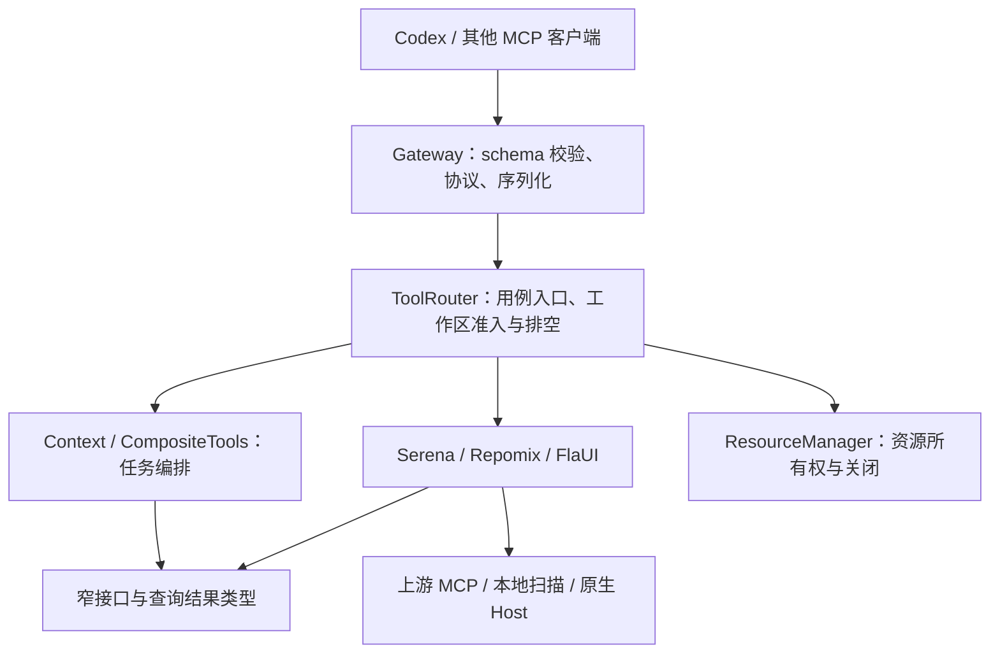

# WinCode 下一轮工程化迭代计划书

编制时间：2026-09-08，北京时间。核查基线：`main@3be2c49a2dc2e24bd22f076a515acbc73ac2c76e`，源码版本 `0.11.2`。

编制时状态：方案待确认，尚未实施。该次审查仅做隔离复现和计划编制，没有修改生产代码、依赖、运行环境或 GitHub 设置，也没有提交或推送。**2026-09-08 用户已要求根据本书逐级实施；当前执行进度见第 9 节。**

本书承接[原迭代路线图](WinCode-迭代路线图.md)，作为下一轮执行与验收依据。原路线图保留历史决策；本书不把已完成的 Serena 身份修复、SDK v2、UI→源码导航再次列为新功能。

## 1. 下一轮目标

将 WinCode 从依靠局部补丁和单次验收维持的工具，推进为**契约明确、依赖方向稳定、资源生命周期可验证、交付可复现的小型软件产品**。

本次审查的判断是：项目已经具备有价值的基础，包括 TypeScript strict、资源管理、工作区请求排空、源码预算、运行身份、生产 stdio 检查、Windows CI 和隔离 UI 夹具。主要缺口在于这些规则没有覆盖所有执行路径，也没有全部成为合并和发布条件。

下一轮不以新增工具数、文件数或测试数量验收。完成后必须能明确回答：

1. 任意公开工具实际接受的输入，是否与公布的 schema 一致？
2. 语义上游不可用、扫描提前停止、配置关闭、请求取消时，结果是否仍然可信？
3. 停止操作返回时，哪些资源已关闭、哪些失败，是否有证据？
4. 从一个明确提交构建出来的 Gateway、原生 Host 和使用手册，是否属于同一套交付？
5. 一次修改若破坏这些规则，是否会在合并前被自动发现？

**建议本轮暂停 R7–R9 功能扩展，完成下述五个工作包后重新评估。**不计划通用插件系统、DI 容器、跨进程服务平台、全仓缓存重写或 XAML/C# 解释器。

## 2. 本次核查结果与证据等级

已读取引用对话「WinCode迭代路线图」最后一次分析，并重新检查当前源码、包配置、工作日志、真实 GitHub CI 和分支规则。以下结论不直接沿用对话中的判断。

| 编号 / 优先级 | 当前问题 | 本次证据与边界 | 工程含义 |
| --- | --- | --- | --- |
| F01 / P0 | Windows CI 仍失败 | main 的 [CI 34177655445](https://github.com/linnnn89/WinCode/actions/runs/34177655445)：Node 20 回归为 234 pass、1 fail、1 skip，stdio 被跳过；Node 24 全流程通过。失败是 `runtime-contract.test.ts` 清理 `other` 目录的 `EBUSY` | 不能以本地通过或 CodeQL 通过替代交付成功 |
| F02 / P0 | main 缺少强制合并检查 | GitHub API 返回 `protected=false`、required checks 为空，分支 rules 返回 `[]` | CI 存在，但尚不是强制合并条件；本轮未修改设置 |
| F03 / P1 | Serena 降级扫描上限和完成状态失真 | 直接调用当前实现，三个子目录各 210 处引用，实际返回 **202** 条，同时 `queryComplete=true`、`truncated=false` | 数据非语义与扫描不完整是两个独立状态，不能混用 |
| F04 / P1 | 限定文件仍先读取其他源码 | 指定 `a/Uses.cs`，读取跟踪仍记录 a、b、c 三个目录的源码；扫描器直接 `readFile()`，没有单文件/总读取预算 | 调用方给出的范围没有成为底层执行边界 |
| F05 / P1 | 合法 JSON 中的源码文字被当成上游错误 | `isError=false` 的有效符号结果，源码分别含 `No active project` 和 `没有激活项目`，均降级并丢失该符号 | 协议解析与业务正文缺少明确边界 |
| F06 / P1 | `Repomix.useCli=false` 未落实 | 受控 spawn 替身记录到版本探测请求；模拟探测成功后仍进入 CLI packing。未真正启动外部 CLI | 配置被当成偏好，未成为不可绕过的执行规则 |
| F07 / P1 | 公布输入类型没有被实际执行 | 实际 SDK InMemoryTransport 调用符号工具，`query` 为对象仍成功，适配器收到 `"[object Object]"`；未知字段也未拒绝。当前 schema 对 query 明确要求 string，但未声明关闭未知字段 | `tools/list` 与 hello 同源不等于 handler 符合契约；需要真实运行时校验 |
| F08 / P1 | 生命周期规则没有贯穿所有路径 | `WorkspaceWatch.stop()` 不等待关闭事件；ResourceManager 提前清空记录并吞掉所有 dispose 异常；Serena/Context 的主要代码查询链没有请求 signal，UI 链已有 signal | 有管理器不等于关闭完成或取消完整。**尚未证明永久句柄泄漏，也未锁定 EBUSY 的具体占用者** |
| F09 / P2 | Gateway 与业务边界耦合 | Gateway 直接调用 `router.serena`；参数校验、switch 分发、错误分类、资源准入和序列化集中在 `McpServer.ts`；CompositeTools 从具体 SerenaAdapter 导入业务数据类型 | 新工具仍需多点同步修改，测试较多依赖覆盖私有成员 |
| F10 / P2 | 交付身份和支持政策不完整 | 构建清单覆盖 TS 产物，未包含 C# Host/交付手册；FlaUI 健康响应写死 version=`1.0.0`。仓库只有 Node lock，未跟踪 NuGet lock/global.json；SECURITY 仍称 0.8.x 为活跃版本 | 无法用一份证据确认安装的是哪套 Gateway、Host、手册；维护承诺与实现漂移 |
| F11 / P2 | 验收入口和证据保存缺口 | `test:all` 只有默认回归和 `test:ui`，不含 `test:ui-code`；CI 没有测试报告 artifact 上传步骤；真实 Serena 链仍没有本轮验收证据 | 测试总数不能说明哪些产品能力已验收，失败后的复查成本较高 |

F03–F07 的隔离探针及 JSON 结果位于 `test-tmp/engineering-review-20260908/`，按既有规则忽略。探针运行于 Node 24.19.0，使用临时源码及受控上游；它们不是实际 Serena 集成测试。没有在本机 Node 20 重现 EBUSY，没有运行本轮完整 GUI 或全量回归。

主要代码依据：[SerenaAdapter](src/Adapters/SerenaAdapter.ts)、[RepomixAdapter](src/Adapters/RepomixAdapter.ts)、[McpServer](src/Gateway/McpServer.ts)、[ToolRouter](src/Core/ToolRouter.ts)、[WorkspaceWatch](src/Core/WorkspaceWatch.ts)、[ResourceManager](src/Core/ResourceManager.ts)、[构建脚本](scripts/build.mjs)、[CI](.github/workflows/ci.yml)。

## 3. 目标架构与不可破坏的规则

### 3.1 依赖方向

下图是建议目标，不代表当前已全部满足。保留现有目录和 ToolRouter 组装方式，按改动需要逐步收紧依赖。

ToolRouter 是允许知道具体实现的组装位置；Gateway 不再访问适配器实例，CompositeTools 依赖实际需要的查询接口。不要为了这张图引入一个新的运行时框架。

### 3.2 工具契约只有一个权威定义

每个工具的名称、别名、JSON Schema、输入校验、执行入口和输出策略集中定义。`tools/list`、hello 的 schema hash 和实际校验使用同一份 schema；跨字段路径/范围约束在该工具的验证函数内处理。

优先复用已安装 SDK 的公开 `@modelcontextprotocol/server/validators/ajv`。本次已直接验证其 `AjvJsonSchemaValidator.getValidator()` 可接受合法输入、拒绝错误类型及 schema 明确禁止的未知字段。**不新增验证库，不自行实现 JSON Schema 解释器。**

可用静态工具表加按用例分组的模块；它只承担注册与类型组织，不承担动态插件发现、服务定位或依赖注入。第一批迁移 `find_code_symbol/find_references/prepare_context`，随后覆盖 workspace、UI 和维护工具，避免并行维护两套长期机制。

### 3.3 结果可信度分为独立维度

| 维度 | 必须表达的含义 | 不得推导的结论 |
| --- | --- | --- |
| 证据来源 | 语义上游、本地文字、运行 UI、声明文件 | 本地文字不能证明符号身份 |
| 执行完成度 | 在声明范围内完成，或因预算、取消、错误而停止 | `degraded` 不能自动表示“扫描已完成” |
| 返回覆盖 | 实际返回了哪些完整行/节点，哪些被裁剪 | 片段完整不等于整个方法/任务完整 |
| 身份与时效 | 请求工作区、运行实例、实际产物、源码哈希 | 同版本号不等于同构建，文件候选不等于运行绑定 |

先建立小型内部查询结果类型，把既有公开字段从它一致地映射出来；不立刻替换所有公开响应为一个大而空的统一对象。缺失证据用 unknown/partial 及原因表达，不能默认为成功或空结果。

### 3.4 资源生命周期有实际完成语义

每个 watcher、子进程、timer、transport 明确唯一 owner；“发起关闭”“已关闭”“关闭失败”不能混为一谈。重复关闭共享同一结果。只管理 WinCode 自己创建的资源，用户应用 PID 不纳入清理。

请求的取消和截止时间从 Gateway 贯穿 ToolRouter、Context、Adapter 到文件扫描/上游调用。工作区切换仍先阻止新请求、排空旧工作；不能只让外层 Promise 提前返回，留下后台扫描继续运行。

`ResourceManager` 继续负责汇集资源；不用它的计数清零冒充 OS 句柄释放。保留“尽力关闭全部资源”，同时报告真正失败，区分已关闭的幂等情况与未知失败。

### 3.5 预算是执行规则

有界读取必须同时约束遍历、单文件、总字节、匹配数量、处理时间和最终序列化。结果上限触发后，所有递归分支停止；限定文件请求不能读取其他源码。

预算语义统一，参数值按任务区分。目录预览、源码扫描、UI 和图片不必共享一个数值或一个忽略目录集合。复用被证明相同的小函数，不建设通用扫描平台。

## 4. 执行顺序、交付物与验收

建议 **五个工作包、五个独立版本 PR**。版本号为当前基线上的建议；实施时先检查 main，避免与其他工作冲突。每包完成 Debug、复测和独立审查后，按最终提交的检查结果合并，再进入下一包。

| 顺序 / 建议版本 | 主题 | 粗估有效工作量 | 退出条件 |
| --- | --- | --- | --- |
| WP1 / 0.11.3 | 修复当前稳定性与降级缺陷 | 2–3 个工程日 | F01、F03–F06 关闭，当前支持矩阵恢复通过；D3 确认后启用现有检查的合并保护 |
| WP2 / 0.12.0 | 工具契约与模块边界 | 2–3 个工程日 | 所有公开工具和别名通过实际 schema/handler 一致性验证 |
| WP3 / 0.12.1 | 取消、资源关闭、诊断语义 | 2–3 个工程日 | 关键生命周期有故障注入和真实进程退出证据 |
| WP4 / 0.12.2 | 构建、发布和项目维护规范 | 2–3 个工程日 | 干净环境可重复构建与验证完整交付，合并门槛生效 |
| WP5 / 0.12.3 | 真实上游与产品任务验收 | 1–3 个工程日 | 完成真实集成矩阵，或按明确限制交付并保留未通过项 |

总估计 9–15 个工程日，是规划量级，不是日历承诺。WP1 完成后以实际修改量和根因更新估计；不假设增加 Agent 数量即可线性压缩。执行者负责实现和证据，独立审查者负责反证与范围审核，用户负责兼容政策和外部设置等重大决定。

### WP1：先让现有能力可靠

**修改范围：**SerenaAdapter、RepomixAdapter、WorkspaceWatch/直接相关关闭路径，以及对应测试和 CI 的失败诊断输出。不要在这一包同时拆 Gateway。

实施次序：

1. 固定当前 CI 失败样本；记录 watcher 关闭事件、WinCode 所有的相关子进程及测试清理顺序。Node 20/24 分别单独和并发运行工作区切换测试。不得先把 Node 20 job 删掉。
2. 修复 `useCli=false` 的 initialize、health、pack 三条入口，先判断配置再使用旧健康缓存；禁用状态直接使用内置路径。复查它是否参与临时目录占用，不预设 EBUSY 一定来自 watcher。
3. 如果缺少关闭完成等待，修补 owner 的等待路径；确认关闭后的短暂 Windows 占用才使用原生 `fs.rm` 有限重试，超限仍失败并保留诊断，不能吞异常。Node 已提供 [FSWatcher close](https://nodejs.org/docs/latest-v24.x/api/fs.html#event-close-1) 与 [rm 重试参数](https://nodejs.org/docs/latest-v24.x/api/fs.html#fspromisesrmpath-options)。
4. Serena 本地 scanner 返回结果及停止原因；全局引用上限 200 必须跨目录生效。候选首轮建议限制为：单文件 256 KiB、总读取 8 MiB、最多 5000 个遍历项、符号最多 500 条，截止时间沿用现有 fileScanMs。先固定内部常量和测试，不新增一组公开调参工具。
5. `relativePath` 在进入扫描前限定读取；逐目录/文件/行检查停止条件。到限、超时、不可读、编码不支持均不能报告完整。相应缓存只保存含真实完成状态的结果，更新受影响缓存键或清理兼容规则。
6. Serena 响应先区分协议错误与有效 JSON；兼容旧纯文本错误时，仅对非 JSON 错误文本识别固定模式。合法源码中的中英文错误文字不改变项目激活状态。

**验收门槛：**202 条反例回到不超过 200 且明确不完整；限定单文件时其他源码读取数为 0；禁用 CLI 的三条入口启动命令数为 0；真错误仍降级、合法 JSON 保留；取消/大文件/不可读与多目录样本覆盖。关闭专项修复后每个支持 Node 版本完成 10 次顺序、10 次并发工作区切换/停止/清理，0 失败、0 取消、无 WinCode 遗留进程；这是有限稳定性证据，不宣称永不出现文件锁。

最后运行支持矩阵完整 CI 和生产 stdio；保留首次失败与修复后的结果。CodeQL 单独列示。

### WP2：把公开契约落实到执行

**修改范围：**Gateway/Protocol、按用例分组的工具定义、ToolRouter 用例入口及直接涉及的查询类型；不用全仓重命名制造大 diff。

- 统一“解析工具名/别名 → schema 校验 → 跨字段校验 → 请求准入 → 用例执行 → 输出/错误序列化 → 释放准入”的顺序。非法参数不得触发扫描、进程探测或工作区变更。
- 保留当前工具名和别名、compact/legacy、图片独立 block、预算与现有有效输入。对象/数组/数字不得以 `String()` 强制变成搜索词。
- 让 Gateway 调用 ToolRouter 的明确用例方法；Serena 的业务类型移到不依赖具体 Adapter 的小型契约模块，原导出可暂时兼容。CompositeTools 只依赖实际使用的查询接口。
- 外部 JSON 入口用 unknown，校验后进入明确类型；逐步替代边界上的 any。避免一轮开启全仓新的 TS 选项并顺手改掉所有历史告警。
- 为未知字段、空字符串、错误类型、范围互斥、缺失参数建立行为表。默认建议关闭未知字段；该兼容变化见第 7 节，不能静默实施。
- 增加少量依赖边界测试，复用已安装 TypeScript：Gateway 不直接导入/访问 Adapter，业务契约不导入 Gateway/具体上游；只检查明确规则，不引入完整架构扫描服务。

**验收门槛：**每个公开工具及别名均有实际 MCP 调用；schema 与 handler 输入行为一致；F07 反例返回明确输入错误且底层调用数为 0；列表/hello/hash/执行定义保持同源；合法历史调用的结果、预算、错误和图片行为无意外变化。一个新工具只增加一个权威定义和必要实现，不再修改多个相互独立的名单。

### WP3：关闭和取消可观察、可验证

**修改范围：**ResourceManager、ToolRouter、WorkspaceWatch、Context、Adapter 的请求参数/关闭路径及相关测试。保持现有锁、排空和所有权机制。

- 引入最小内部操作上下文（signal、截止时间），覆盖代码扫描和上游调用；UI 已有的取消能力保留并复测。预算由具体操作持有，不借此增加万能 Context 服务。
- 关闭结果保留资源 owner、kind、最终状态和有限错误摘要；幂等已关闭不报故障，真正失败可诊断。单个清理失败不跳过其他资源，也不伪造整体成功。
- 核对子进程 `exit/close`、stdio 关闭、孙进程回收的责任边界；仅跟踪自有进程。测试应核对实际 PID 退出，不能只看 activeProcessCount=0。
- 区分被动身份/已知状态快照和主动健康探测。hello 查询身份不应隐式触发无关 CLI/上游启动；保留旧主动探测需求的明确入口或选项，具体兼容契约先固定再改。
- 对初始化失败、运行中取消、排队时取消、切换时取消、关闭失败、重复关闭建立状态转换表。错误只记录定位需要的摘要，不默认写入源代码、输入框内容或凭据。

**验收门槛：**上述状态转换逐项通过；请求取消后底层工作在既定截止时间/清理宽限内结束，随后请求仍可成功；工作区切换不返回旧工作区证据；任一关闭失败可见且不阻断其他清理；被动身份查询外部进程启动数为 0。无需为此引入遥测服务。

### WP4：建立可复现的交付和维护规则

**修改范围：**构建/验证脚本、CI、项目约定、支持文档、原生 Host 的身份字段及必要 DTO 边界。现有 Host 已有 BoundedUiSearch、UiPropertyEvidence、CaptureQuality 等拆分，不重复建立另一套。

1. **固定构建输入。**保留 npm lock；为 Host 使用 NuGet lock 与锁定恢复，给 .NET SDK 写明确的版本/roll-forward 政策；补 `.gitattributes` 和 `.editorconfig`，规定文本行尾，避免相同逻辑因 checkout 换行策略改变 sourceHash。更新锁文件只能出现在明确的依赖维护 PR。[NuGet 官方机制](https://learn.microsoft.com/en-us/nuget/consume-packages/package-references-in-project-files#locking-dependencies)
2. **统一交付清单。**继续保留 Gateway manifest，增加一个交付级清单关联 Git 提交、Node/.NET 构建环境、Gateway、Host 二进制及必要 sidecar、受管 Skill 哈希。不要用时间戳或绝对安装路径参与内容身份；声明哈希证明本地一致性，不冒充签名真实性。
3. **Host 身份可信。**健康结果不再写死 `1.0.0`；用真实 Host 版本/构建信息核对。发现旧 Host/缺文件时明确不一致，不自动改用 Debug 产物或临时编译以掩盖发布缺失。开发模式与交付模式的可用路径需明确区分。
4. **形成一个本地验收入口。**拟新增 `check`：类型检查 → Gateway 构建 → Host 与两个控制台夹具预构建 → 非交互回归 → 生产 stdio/契约检查；拟新增 `check:desktop`：隔离 WPF 预构建 → UI/协议 → UI 源码修复闭环。真实上游另设明确 opt-in 入口。这些是建议命令，当前尚不存在。`test:all` 要么包含承诺的套件，要么更名并写清范围。维护一个小型套件清单，检查新增测试未被意外遗漏。
5. **CI 保留可复查证据。**失败时仍上传限额测试报告、命令/环境、build/schema hash 和资源摘要；公开 runner 只使用仓内合成夹具，禁止上传 TavernDesk 正文、个人配置或截图。交互桌面验收不伪装成 hosted runner 已执行。
6. **合并条件生效。**D3 确认且 WP1 恢复通过后，先启用现有 main 必需状态检查、禁止直接推送和 force push；WP4 再随新增检查更新规则，required checks 与矩阵实际名称一致。独立审查必须有记录；单维护者仓库不要求作者完成自己无法提交的 GitHub approve，可使用独立审查报告加无未解决严重问题作为人工门槛。[GitHub 分支保护](https://docs.github.com/en/repositories/configuring-branches-and-merges-in-your-repository/managing-protected-branches/about-protected-branches)
7. **维护文档保持一致。**增加精简 CONTRIBUTING，包含构建/测试入口、PR 规则和依赖方向；修正 SECURITY 的支持版本及无法保证的响应承诺。清理 IAdapter、ExtensionManager 中“FlaUI 未实现”等过期表述，冻结无实际用户的插件入口；是否移除要检查引用和公共兼容性。不批量改写已有历史日志。

**验收门槛：**干净 checkout 按文档成功构建和检查，不借用已有 dist/bin；两次构建的内容身份稳定，替换旧 Host/手册后能检测不一致；交付可在非仓库工作目录启动并完成 stdio/Host 握手；版本支持表、README、package engines、CI 矩阵一致；真实 required checks 生效后才声称“合并受保护”。旧版本可通过保留完整产物和配置说明回退，不使用不可逆就地覆盖作为默认升级方式。

### WP5：用真实集成决定是否进入下一轮功能开发

**修改范围：**明确 opt-in 的验收脚本、合成/专用夹具、汇总报告与必要缺陷修复；不借集成测试自动安装上游或读取个人数据。

- **Serena：**对实际安装版本的 C# 项目运行“同名/重载 → 完整身份 → 引用 → 源码正文”，覆盖合法空结果、项目未激活、上游中断、降级扫描，记录命令版本和协议信息。mock 身份测试保留，但不代替此项。
- **UI：**复用既有隔离 WPF 源码修复闭环，以及固定 TavernDesk 测试目录；检查 PID/HWND、状态、XAML/C# 候选、源码哈希和修复后结果。截图质量提示只作为提示，不以 API 成功或像素有变化证明画面可用。
- **产品价值：**沿用现有小样本记录方法，增加 4–6 个“未知位置或 UI→源码”的任务。记录定位是否正确、关键证据缺口、调用数、UTF-16 字符、可测耗时和跨调用重复源码行；已知文件读取继续允许原生工具。已有四项对照显示 MCP 起步调用更多，不能只挑有利样本宣传普遍提速。

**验收门槛：**发布说明有“能力 × 环境 × 真实/受控 × 结果”的矩阵；已通过、失败、跳过、未验证分开。真实 Serena 若因安装/激活条件未满足，工程修复可以独立交付，但不得宣称真实语义集成已通过，WP5 保持部分完成。只有新证据证明当前能力确实拿不到关键内容时，才重开 R7–R9。

## 5. 每个 PR 的完成定义

必须同时满足：

- 问题与改动可追溯：关联本书 F 编号/工作包，给出一个具体失败或能力缺口，不以“优化架构”作为唯一理由。
- 写明有效输入、错误输入、降级、取消、关闭和兼容影响中本次涉及的项；修复类先保留失败反例，结构调整先固定现有行为。
- 改动只覆盖该工作包；新抽象必须有现有调用方和明确职责，无法说明的先不加入。
- 本地定向验证通过，受影响完整套件与最终提交的 required CI/CodeQL 通过；任何 skip 写明原因，不以重跑直到绿代替修复。
- 独立审查检查至少一个“测试通过但结论仍可能失真”的场景；作者自审不冒称独立审查。严重问题归零后合并。
- README/Skill/支持策略中受影响部分同步；工作日志记录命令、环境、版本/build/schema、失败过程、结论边界和 PR。
- 使用普通 revert 或保留完整旧产物可回退。接口调整提供兼容映射/迁移说明；不通过 force push 改写已经发布的历史。

若修改量超出单次可靠审查范围，按职责拆 PR，保留相同里程碑退出条件，不为压缩 PR 数合入未验证的半成品。

## 6. 成功判据与停止条件

| 维度 | 本轮结束时应达到 |
| --- | --- |
| 接口一致性 | 所有公开工具和别名均实际验证；错误类型、未知字段政策与公布 schema 一致 |
| 降级可信度 | 全局预算有效，所有提前终止有原因；没有“扫描没完成却声明完整”的已知样本 |
| 生命周期 | 关键取消/关闭场景有完成证据、错误可见、自有进程无残留；不触碰目标应用进程 |
| 发布可复现 | 干净环境可构建验证，Gateway/Host/Skill 身份可对应；替换错误产物能被发现 |
| 工程门槛 | required CI 生效，失败报告可获取，独立审查与版本兼容政策可执行 |
| 使用价值 | 真实集成与任务证据表支持能力声明；不把 mock、字符估算或局部样本扩大为通用结论 |

达到这些条件后结束治理轮次，不继续为了代码外观拆文件。若需要重写资源管理器、引入新解析器/服务、扩大支持平台或改变产品边界，停止该分支并提交新决策，不纳入本书的“普通细节”。

## 7. 需用户决定的事项

本书给出推荐，**不把写入计划视为已经获准改变兼容性、依赖或外部配置**。

| 决策 | 推荐与可选路线 | 未确认时如何处理 |
| --- | --- | --- |
| D1 / Node 支持政策 | 推荐 Node 24 为主要运行环境、22 为兼容环境；20 作为现有兼容线先保留定位和修复，之后明确结束支持或限期维护。Node 官方目前将 20 标为 EOL，22/24 为 LTS；SDK 最低版本不能替代产品支持政策。[官方状态](https://nodejs.org/en/about/previous-releases) | 保持已接受的 `>=20` 和 20/24 检查，不通过删除失败 job 掩盖缺陷；新增矩阵及最终 engines 变更另行确认 |
| D2 / 输入严格性 | 推荐 WP2 统一拒绝未知字段/错误类型，保留合法旧输入和工具别名；若有依赖字符串数字或额外字段的真实调用方，先给有期限的兼容规则 | 本轮仅计划；执行前盘点真实调用形态，锁定行为表，不静默改变公共接口 |
| D3 / 合并保护 | 推荐 main 强制通过支持矩阵和 CodeQL，禁止直接推送/force push；独立审查结果作为合并依据 | 可编写仓内 CI 和规则说明；未经确认不改 GitHub rules/权限，不声称已受保护 |
| D4 / 真实上游环境 | 推荐复用实际已安装 Serena 和专用 C# 夹具；若缺运行时、包或语言服务，先报告所需资源/版本/成本 | 不自动下载模型、上游二进制或改全局配置；该验收项标未验证 |
| D5 / 静态风格工具 | 当前先用既有 TS strict、编译器、editorconfig 和局部约定。若后续需要 ESLint 等新依赖，只采用少量能发现真实问题的规则 | 不把安装新 lint/格式化依赖作为前四包的必需前置，不进行全仓格式化 |

## 8. 执行起点

用户确认总体方案后，先从 **WP1 / 0.11.3** 开始：保留 CI 失败证据，确认相关资源关闭，再修复四类已证实问题；不要先做文件拆分或扩大功能。WP2 之前固定 D2 行为表；支持矩阵变更和 GitHub 保护分别在 D1、D3 明确后落实。

本轮方案参考了引用对话的最新分析，但将其“集中补丁”进一步扩展为有验收条件的工程治理：**先恢复可信行为，再统一契约与生命周期，最后把它们固化为可重复的交付规则。**

## 9. 执行记录

- 2026-09-08：总体实施已授权，按每个版本复测、Debug、独立审查、PR、核对检查再合并推进。WP1 在 `codex/wp1-stability` 实施；不提前标记后续工作包完成。
- D1：用户明确同意 Node 升级。WP1 先保留 Node 20/24 故障复测，WP4 同步 Node 24 主支持、22 兼容及最低版本政策。
- D2：用户明确选择保持容忍模式。WP2 校验已声明字段，容忍额外字段；Skill 手册必须写清规范字段、类型、必填/可选、互斥与示例，未声明字段不保证生效。该决定取代第 7 节的严格未知字段推荐。
- D3：GitHub 分支保护仍待确认，不将 Node 升级或字段政策决定扩大解释为修改 GitHub 设置的授权。
- WP1 已完成：0.11.3 / [PR #22](https://github.com/linnnn89/WinCode/pull/22) 于 2026-09-08 合并，main=`31b7dd1`。最终 Node 20/24 CI 与 CodeQL 通过，各版回归 267 pass、1 skip，10 顺序+10 并发生命周期通过。失败反例、独立审查及短路径测试修正见 [工作日志](docs/codex_worklog.md)。
- WP2 正在实施：0.12.0，按用户 D2 决定保留额外字段容忍、校验已声明字段，并在现有 Skill 文件明确规范字段，不新增验证依赖。
- 新发现 F12：GitHub [code scanning #1](https://github.com/linnnn89/WinCode/security/code-scanning/1) 在 `31b7dd1` 仍为 open/medium，Repomix 启用路径经 cmd 处理环境路径。只读方案为 Node 直启已安装 JS 入口、移除 shell 链；涉及 npx 缓存/PATH 包装脚本兼容变化，已单独请求决定，未擅自实施或关闭告警。
- GitHub 经验落实：参考 [Node watcher 实现](https://github.com/nodejs/node/blob/main/lib/internal/fs/watchers.js) 与 [VS Code 生命周期管理](https://github.com/microsoft/vscode/blob/main/src/vs/base/common/lifecycle.ts) 的 owner、幂等及失败语义；复用现有 ResourceManager，未引入新的管理框架。
- 2026-09-08 更新：WP2 / 0.12.0 已按精确 head CI 合并 PR #23（main=39d2b20）。WP3 / 0.12.1 实施中，用户已确认 hello 被动、diagnose 主动；后续默认由主代理推进，独立审核与自审分别记载。
