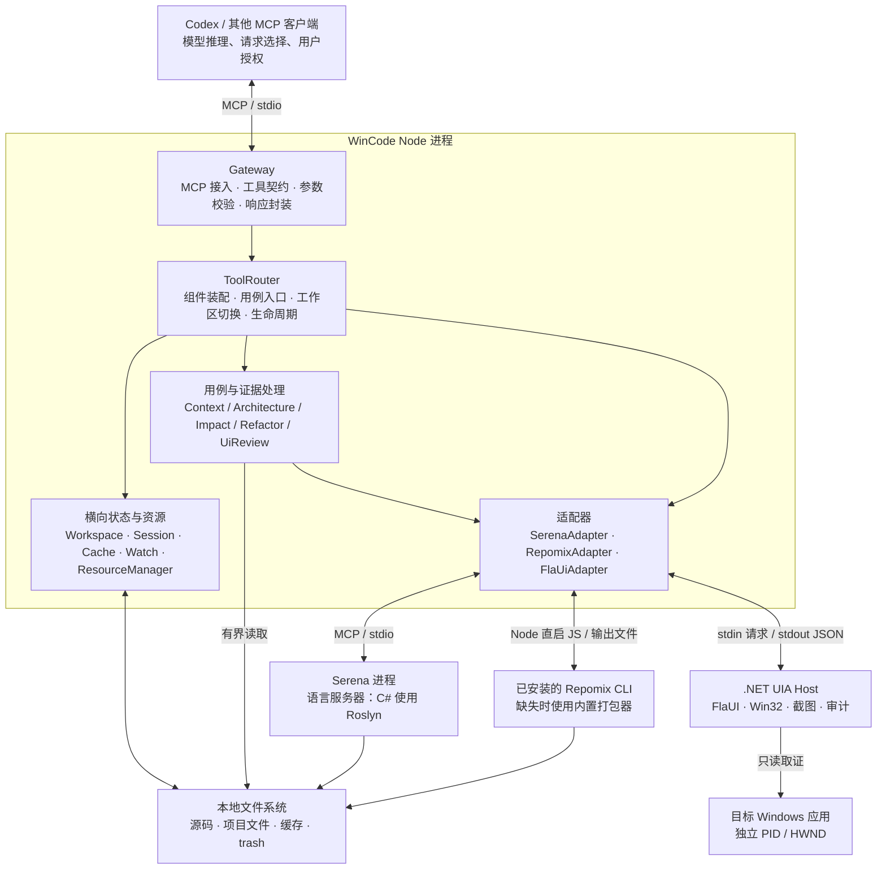
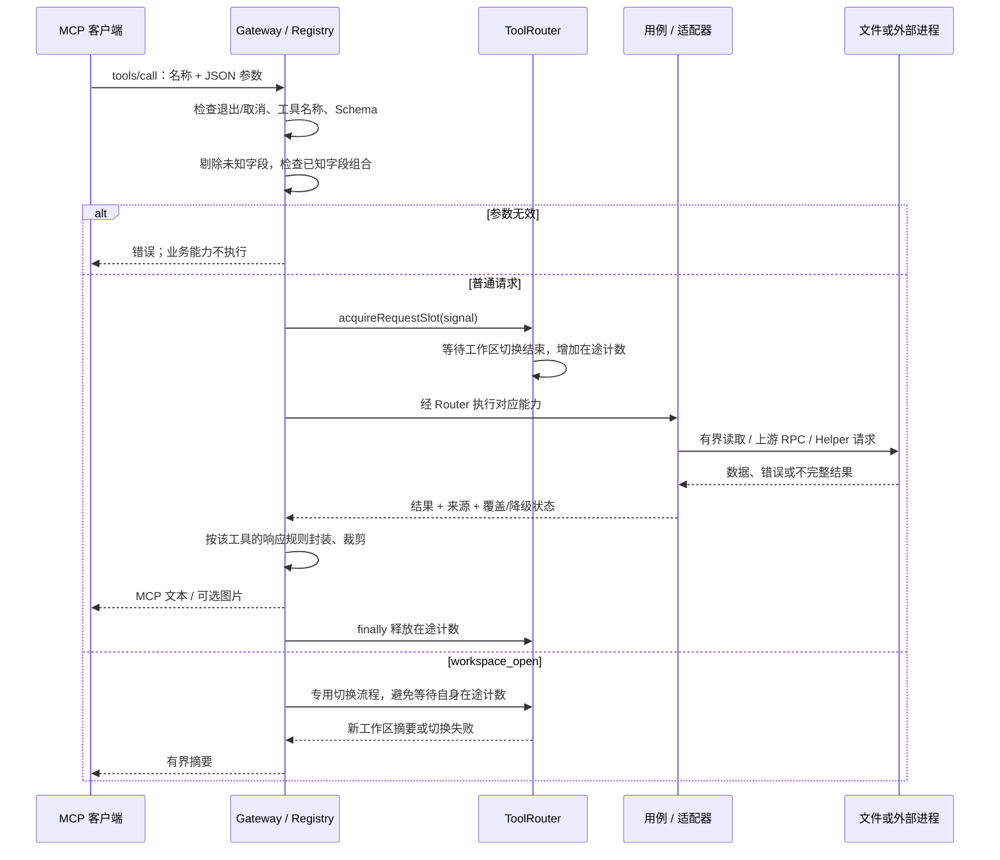
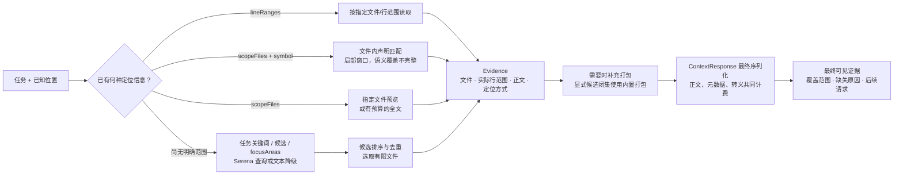
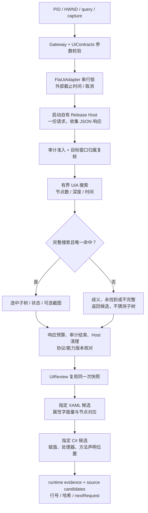
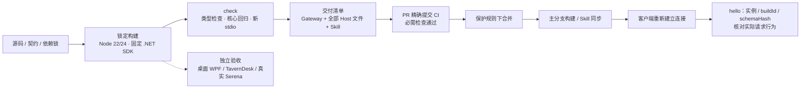

# WinCode 架构、数据流与检查关口

**基线：0.12.5，main `10496e0`；核对日期：2026-09-08（北京时间）。**

本说明描述当前源码中已实现的结构。GitHub 分支保护已在本次只读核查中确认；历史实测结果见[工作记录](docs/codex_worklog.md)。源码版本、磁盘构建和客户端当前连接是三个不同对象，不能互相替代。

## 1. 整体定位与结构

WinCode 是一个运行在本机的 **MCP 工具网关**：接收编码 Agent 的结构化请求，组织代码或桌面证据，再把正文与证据边界一起返回。Agent 的模型推理在客户端侧；WinCode 自身没有模型推理服务或向量数据库。

主体采用**分层单体 + 外部工具适配器 + 进程外桌面取证**。每个 Gateway 进程只有一个活动工作区；外部上游与 UI Helper 各有独立生命周期。

图中箭头表示主要调用或数据联系，不表示每条请求都经过全部组件。原生 Host 的进程隔离用于故障与生命周期控制，**不等于操作系统安全沙盒**。

| 层 / 模块 | 负责什么 | 设计边界与源码入口 |
|---|---|---|
| 启动层 | 解析 workspace/development 参数，创建 Router 和 MCP Server，处理退出 | [index.ts](src/index.ts)；当前入口以默认配置和 CLI 参数启动，不是通用配置中心 |
| Gateway | 列举工具、校验输入、执行工具、封装结果 | [McpServer](src/Gateway/McpServer.ts)、[ToolRegistry](src/Gateway/ToolRegistry.ts)；不直接调用适配器字段 |
| ToolRouter | 创建并组合组件，提供用例入口，协调请求与工作区生命周期 | [ToolRouter](src/Core/ToolRouter.ts)；这是装配与协调中心，不只是名称路由表 |
| 核心能力契约 | 定义符号、引用、打包、UI、操作取消等数据类型 | [CodeQueries](src/Core/CodeQueries.ts)、[ContextPacking](src/Core/ContextPacking.ts)、[UiContracts](src/Core/UiContracts.ts)、[OperationContext](src/Core/OperationContext.ts) |
| 用例层 | 项目结构分析、上下文组织、影响评估、重构建议、UI→源码候选 | [Context](src/Core/Context.ts)、[CompositeTools](src/CompositeTools)；消费窄接口，保留来源与不完整状态 |
| 适配器层 | 上游协议、响应解析、超时、失败降级及子进程管理 | [Adapters](src/Adapters)；Serena 的语义结果与本地文本结果分开标识 |
| 原生 Host | 按 PID/HWND 取证，执行有界 UIA 搜索及截图 | [Program.cs](tools/WinCode.UIA.Host/Program.cs)、[BoundedUiSearch](tools/WinCode.UIA.Host/BoundedUiSearch.cs)、[UiAudit](tools/WinCode.UIA.Host/UiAudit.cs) |
| 构建交付层 | 锁定构建、回归、stdio 验证、产物身份、Skill 一致性 | [check.mjs](scripts/check.mjs)、[delivery-manifest](scripts/delivery-manifest.mjs)、[sync-skill](scripts/sync-skill.mjs) |

`ExtensionManager` 目前保留兼容接口，没有内置注册项，不承担实际插件生态或工具发现职责。Gateway 当前列出 15 个工具名称，其中包含影响分析别名；工具名称数量不等于独立业务能力数量。

## 2. 一次请求怎样通过系统

**输入契约只有一个注册来源。** WorkspaceTools、CodeTools、UiTools 将 Schema、额外校验和执行函数组织在同一工具定义中；ToolRegistry 同时生成工具列表和分发索引，并计算 schemaHash。

**容忍未知字段，严格校验已知字段。** 未声明字段可出现在协议请求中，但会在递归整理参数时被剔除，不能影响业务或原生请求；声明字段不做字符串→数字等隐式类型转换。例如，拼错 `lineRanges` 不会自动启用范围检索。

**准入不是全局限流器。** 在途计数主要用于保护工作区切换和关闭；当前没有一个统一的“全部请求最多并发 N 个”策略。UI 请求及 UI 健康探测另有适配器互斥锁。

## 3. 代码证据的数据流

### 3.1 三种数据不要混用

| 数据 | 生产者 → 使用者 | 必须随数据保留的信息 |
|---|---|---|
| 符号 / 引用 | SerenaAdapter → Context、Impact、Refactor | `source`、`namePath`、文件、行、`queryComplete`、歧义、截断；引用行的 `lineKind` |
| 源码正文 | 文件读取 / 打包 → ContextResponse → Agent | 实际起止行、末行是否完整、`locationKind`、省略原因与范围覆盖 |
| 项目结构 | Workspace / DotNetGraph → ArchitectureAnalyzer | 从 `.sln`、`.csproj` 等文件提取的声明关系；不代表 MSBuild 动态求值后的实际编译图 |

`prepare_context.candidateFiles` 是优先候选，不承诺排除其他发现路径；`scopeFiles` 与 `lineRanges` 才明确限定相应读取范围。RepomixAdapter **内部**收到显式 `candidateFiles` 时则视为闭集，避免转入全仓 CLI 打包。这两个层次的同名参数不能混为一谈。

### 3.2 语义链与降级链

SerenaAdapter 懒连接真实上游，先握手、获取工具列表，再查询。状态分为命令已发现、握手成功、项目激活、语义查询可用；前一层成功不自动推导后一层成功。

真实符号结果保留完整 `namePath` 和重载标识。简名对应多个身份时返回 ambiguous，引用查询不擅自选择第一项；指定身份查询仍要核对完成状态。上游失败时可使用有文件数、字节数和时间预算的本地正则扫描，结果明确为文本降级。

0.12.5 处理了真实 Serena/FastMCP 的 `structuredContent.result` 字符串包装；合法空数组和零引用保留语义来源，错误或不支持的结构不会被当作成功。ImpactAnalyzer 对身份不唯一或查询不完整的情况保留 `UNKNOWN`；零引用不构成“可以安全删除”的证明。

### 3.3 输出预算位于最后一公里

`maxTokens` 当前按 UTF-16 字符数 / 4 估算，最终 MCP 文本块的 JSON 转义、元数据及 legacy 附加文本共同占预算。它不是模型 tokenizer 的精确结果。

ContextResponse 在最终裁剪后重新计算范围覆盖，区分读取阶段不足和响应预算不足，并给出缺失区间或后续请求。符号窗口没有解析方法结束边界，`symbolCoverage=unknown` 不能被显示的几行正文替代。

## 4. 桌面取证与源码候选的数据流

- UIA 属性和截图来自目标应用的实际窗口；应用是否提供 AutomationId/Name 决定可检索程度。缺失可访问性信息不等于网关查询代码故障。
- 有查询条件时，只有 `SearchComplete` 且恰好一个命中才展开选中子树；找到一个节点但搜索未完成，仍不能声称唯一。
- `backgroundOnly` 要求 PID/HWND，走后台捕获政策；图像质量为 `unknown` 或低变化提示时，不声称截图一定可读。
- UI→XAML→C# 是候选证据链。动态绑定、模板、资源字典没有被完整求值；保持 `runtimeSourceVerified=false`。源码候选读取失败时保留已取得的 UI 快照。
- Host 使用 UIA/Win32 读取目标窗口；取消与超时清理自有 Helper，不终止目标应用。该设计不提供点击、输入或聊天生成能力。
- 审计保存开始/结束等简要记录；达到阈值时提醒或拒绝新 UI 访问。日志是本地可写文件，不提供防篡改保证。

## 5. 状态、存储与生命周期

### 5.1 数据在哪里

| 数据位置 | 保存内容 | 生命周期 / 边界 |
|---|---|---|
| Node 进程内 | 当前 session、请求计数、适配器连接状态、内存缓存、资源记录 | 每 Gateway 一个活动工作区；退出后不保留这些内存状态 |
| 启动配置的 `cacheDir`，默认 `.cache/wincode` | 缓存 JSON、打包临时文件、overflow 正文 | 按工作区 namespace 隔离；切换项目保留缓存目录，避免向每个项目散写缓存 |
| 工作区源码与项目文件 | 输入证据 | 代码分析通常读取；不会因为生成重构计划就自动修改源码 |
| 配置的 `trashDir` | 被移动的文件和 `.meta.json` 元数据 | `safe_move_to_trash` 是实际写操作；路径/真实路径检查后移动，非永久删除 |
| `%LOCALAPPDATA%/WinCode/logs/ui-audit` | UI 取证审计 | 有容量准入；不自动删除审计来恢复访问 |
| `dist/`、Host Release 发布目录 | Gateway 与原生交付产物 | 构建/交付脚本管理；客户端进程不会因文件更新自动重载 |
| `test-tmp/` | 检查报告、隔离夹具、本轮获准安装的真实上游 | 开发验收数据，不提交到 Git；真实上游安装不等于默认连接已配置 |
| 已安装 Skill 目录 | Agent 使用手册 | 独立于源码和运行进程；同步前备份，之后核对内容 |

缓存同时使用工作区 namespace、fingerprint 与 TTL。Watcher 使文件变化能失效短期 fingerprint 记忆；内存默认预算 32 MiB，磁盘默认 128 MiB（含 overflow），单项默认 2 MiB。这些是缓存数据预算，**不是整个 Node 进程 RSS 的硬上限**。

源码、磁盘状态和多个调用之间不存在数据库式快照事务；Watcher/fingerprint/TTL 也不能保证每次观察均与外部写入同步。需要判断新鲜度时应结合实际文件哈希、结果范围及变更时间。

### 5.2 工作区切换

`工作区互斥锁 → 暂停普通请求进入 → 等待旧请求结束 → 校验/打开目标 → 更新 namespace/session/fingerprint → 重绑 watcher → 关闭并重建相关上游状态 → 恢复请求准入`。

旧请求不能在限定时间内结束时，拒绝切换；等待期间可以取消。开始提交切换后完成必要收尾，当前实现不承诺跨文件系统、适配器与缓存的事务性回滚。

### 5.3 取消与退出

代码用例把客户端 signal 与操作 deadline 传入扫描/上游路径。当前代码用例总预算由 Serena 连接、调用和文件扫描预算合成（默认 43 秒）；具体外部操作还有各自超时。UI 另有 Helper 超时，默认 10 秒。原生调用或单次磁盘 I/O 不一定能立即中断。

关闭时拒绝新请求、取消代码操作、等待在途请求，并依次尝试停止 watcher、各适配器、扩展兼容项，刷新缓存写入、关闭 session 和资源管理器。主要关闭路径保留聚合错误，重复 dispose 共享结果；不能仅凭进程计数为零证明所有清理成功。ResourceManager 保存有限的进程内清理记录，真实验收另检查已知自有 PID 是否退出。

## 6. 检查关口：阻止什么，依据是什么

| 关口 | 位置 | 检查 / 处理 | 不能据此声称什么 |
|---|---|---|---|
| G1 工具契约 | ToolRegistry | 名称、类型、范围、字段组合；未知字段剔除 | 容忍拼写错误不表示对应能力生效 |
| G2 请求与工作区 | Gateway / ToolRouter | 取消/关闭检查；切换互斥与在途排空 | 不是所有请求统一串行，也不是多租户隔离 |
| G3 文件与范围 | Workspace、Context、UI 源码 mapper | 相对/真实路径、工作区边界、候选数量、文件/读取预算 | 路径检查不是 OS 沙盒或完整文件事务 |
| G4 上游启动 | 各 Adapter | 配置禁用、可用性、超时；Repomix Node 直启 JS | 已安装脚本本身的可信性没有因此被证明 |
| G5 语义身份 | SerenaAdapter / ImpactAnalyzer | 完整身份、重载、歧义、协议错误、完成状态 | fallback、零引用或非空结果不等于安全重构 |
| G6 UI 准入 | Host / UiAudit | PID-HWND 归属、后台策略、审计容量、搜索预算 | computer-use 其他链路的窗口归属不是本模块证据 |
| G7 UI 返回 | Host / FlaUiAdapter | 文本/图片/管道预算、协议与 inspectionVersion | 像素有变化不等于画面可用，候选不等于绑定已证实 |
| G8 最终正文 | ContextResponse / UiResponse | 最终序列化预算、截断、省略与范围信息 | 正文覆盖不等于任务推理充分，估算字符不等于精确 token |
| G9 生命周期 | OperationContext / ResourceManager / Router | deadline、取消、自有进程关闭、缓存写入排空 | 单一 dispose 返回或资源计数不是全部外部进程的证据 |
| G10 交付一致性 | 构建清单 / delivery verify | Gateway、完整 Host 发布文件、配置与 Skill 的版本/哈希 | 内容一致性不是数字签名，磁盘新版不等于连接新版 |
| G11 合并 | GitHub 保护与 CI | Node 22/24 + 三项 CodeQL、PR、管理员约束、禁止 force push/删除 | CI 绿色不证明真实桌面/Serena已验收，也不证明所有安全告警关闭 |

G1–G10 分布在运行时和本地交付工具中；G11 依赖远端仓库配置。人工授权、是否接受重构方案、是否安装真实上游等，仍属于客户端/维护流程的决策，不能把 Skill 的文字说明当成服务器权限系统。

## 7. 从源码到客户端实际使用

`hello` 从 0.12.1 起只读已知状态；主动检查使用 `diagnose_project`。未知值明确保留为 unknown/null，历史健康结果可能陈旧。Gateway 初始化仍会初始化适配器，轻量 hello 不表示整个启动过程没有探测成本。

当前分支保护强制 Node 22/24 回归和 CodeQL 的 JavaScript/TypeScript、C#、Actions 三项检查，对管理员生效；按单维护者政策要求的 GitHub approval 数量为 0。**因此独立审核仍是额外流程，不是仓库规则已保证的事实。**

真实 Serena、交互桌面验收分别是 opt-in 命令，没有被普通 CI 自动覆盖。0.12.5 已有真实 Serena/Roslyn 的七项隔离实测；源码正文其中使用了直接上游 oracle，不应推广成 WinCode 已提供完整方法正文接口。

## 8. 当前设计的工程成熟度与明确边界

已经形成的结构约束包括：统一工具契约、Router 用例入口、Core 能力接口、适配器进程边界、工作区生命周期、证据元数据、最终输出预算以及可复查的交付清单。[架构边界测试](tests/architecture-boundaries.test.ts) 检查 Gateway 不跨过 Router 访问适配器、CompositeTools 不导入 Adapter、Core 不反向依赖 Gateway 等具体规则。

维护时仍应认识以下边界：

1. **ToolRouter 同时承担装配、状态和生命周期协调。** 当前职责集中且可定位；扩展功能应走既有用例与契约，不继续把具体上游访问塞进 Gateway。
2. **结果协议有工具族差异。** UI 使用 success/errorCode 等字段，代码结果侧重 source/completeness，部分 Gateway 错误仍为文本；目前不能宣称全软件已有单一错误信封。
3. **检查是分路径落实的。** 范围读取、候选 mapper、目录扫描和 trash 各自设边界；不能把某条路径的检查推广到所有低层文件调用。
4. **生成计划与执行修改分开。** 重构工具提供建议与检查清单；代码修改、编译、Git 提交与 PR 操作由外部工程协作工具执行。trash 是需要特别识别的实际文件写入口。
5. **运行时一致性仍需客户端参与。** Gateway 实例身份、原生 Host 身份与交付清单提供核对依据，但系统没有自动替客户端重连旧 MCP 实例的能力。

本说明的架构图、数据表与关口表共同描述当前实现；新增功能应说明接入哪条数据流、使用哪个现有契约、在哪个关口拒绝或降级，以及如何留下真实验收证据。

下一轮可靠性工作见[待实施计划](WinCode-下一轮工程化迭代计划书.md)：工作区切换后续步骤失败的一致性、trash 移动后元数据失败的部分完成语义、有界混合负载验收，以及错误契约渐进整理。前两项来自静态调用链审查，仍需故障注入确认；后两项是验证和一致性改进，不能据此断言当前已有泄漏或必须整体重构。
