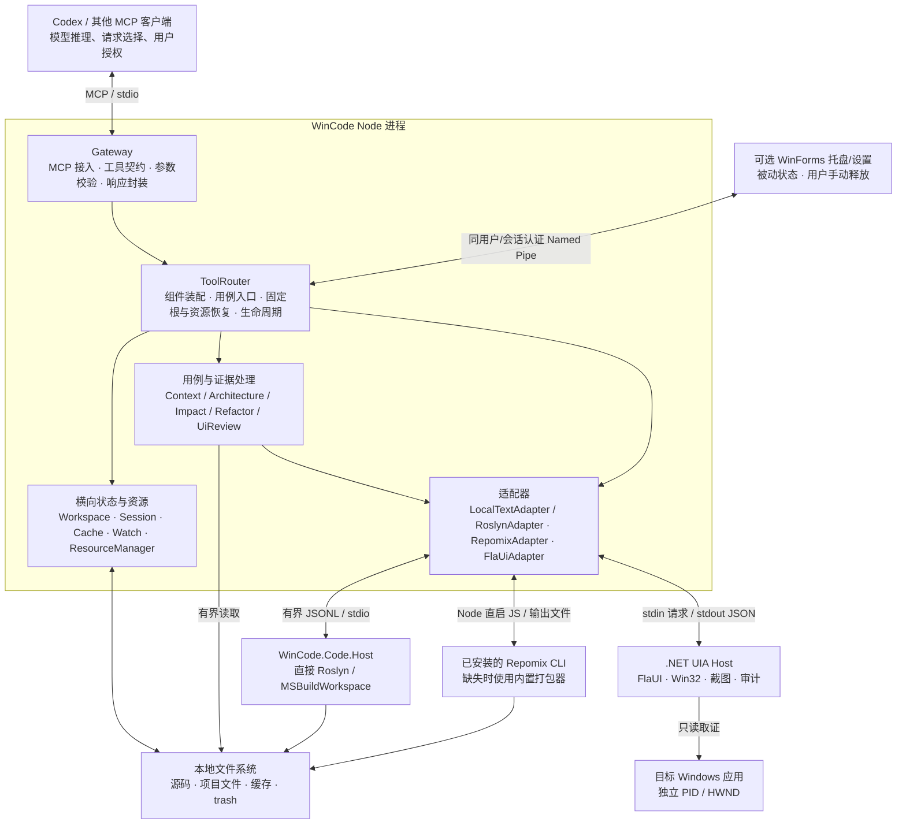
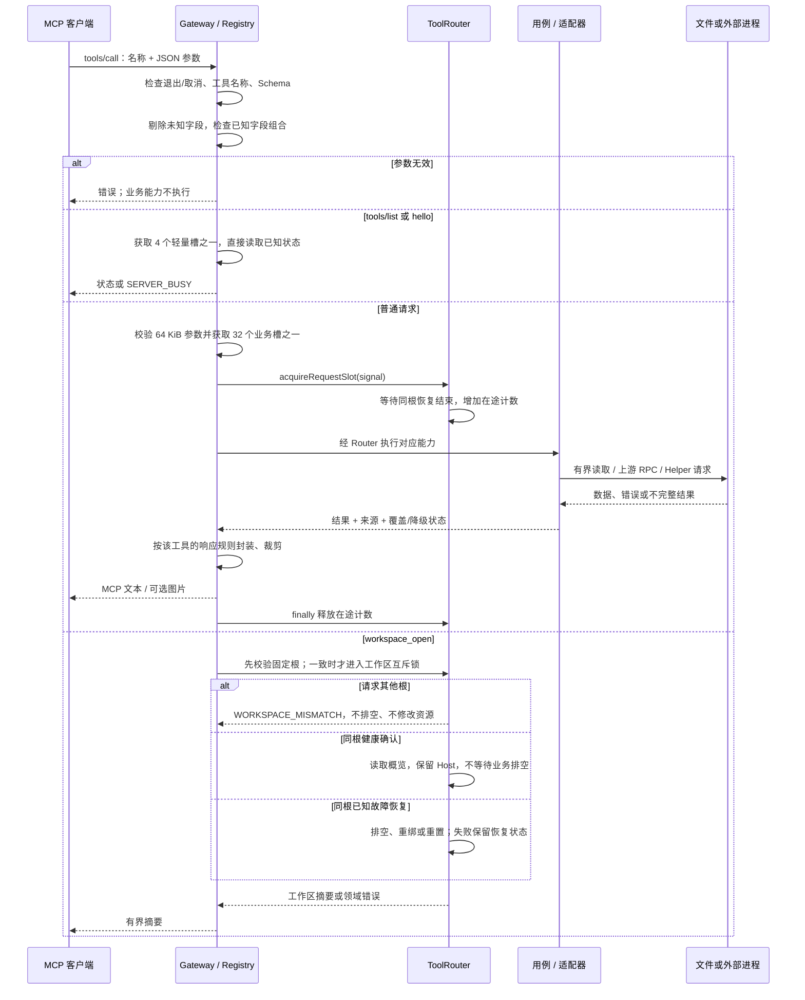
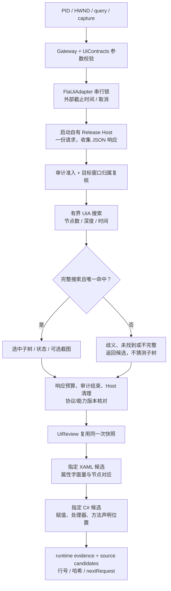
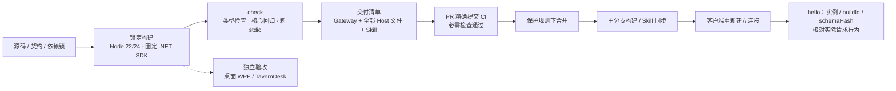

# WinCode 架构与数据流

**适用版本：0.15.0，main `d51f3e1`；更新：2026-09-11（北京时间）。该版本已合并，Node 22/24 和 CodeQL 检查通过，尚未发布 GitHub Release。实际客户端 Roslyn 流程和 UI 并发测试仍待完成，当前测试结果见 [README](README.md)。**

本说明描述当前源码中已实现的结构。GitHub 分支保护的历史只读核查日期为 2026-09-08；本轮核对 PR 检查状态，不把它等同重新审计全部保护设置。历史实测结果见[工作记录](docs/codex_worklog.md)。源码版本、磁盘构建和客户端当前连接是三个不同对象，不能互相替代。

N4 实现：`DesignTimeBuild` 使用已有 SDK 的 ProjectCollection 做原项目求值，保留原中间目录的 Compile 排除规则及自定义导入；目标运行仍交给 MSBuildWorkspace，使用每 Host UUID 的私有 IntermediateOutputPath。Configuration/TargetFramework 必须为字面目录段，规范化后的输出必须位于所属 UUID 内；原求值的无效项目异常保持 `PROJECT_LOAD_FAILED`。输入扫描仅过滤已判定不参与默认编译的原中间产物，实际文档/显式输入仍校验，自定义 Compile 保守处理。`OwnedBuildOutputs` 记录原生所有权清单，正常关闭回收；`RoslynHostClient` 在实际退出后调用 `DesignTimeArtifacts` 回收所属命名空间。内部 inputPolicy 为 2，缺失/旧策略 Host 的拒绝和进程回收已有专项测试。当前发布目录通过交付身份核验；复杂 target、任意动态项目图及断电后的孤儿产物仍不在本地通过范围内。

## 1. 整体定位与结构

WinCode 是一个运行在本机的 **MCP 工具网关**：接收编码 Agent 的结构化请求，组织代码或桌面证据，再把正文与证据边界一起返回。Agent 的模型推理在客户端侧；WinCode 自身没有模型推理服务或向量数据库。

主体采用**分层单体 + 外部工具适配器 + 进程外桌面取证**。每个 Gateway 进程在启动时固定一个工作区；外部上游与 UI Helper 各有独立生命周期。

图中箭头表示主要调用或数据联系，不表示每条请求都经过全部组件。原生 Host 的进程隔离用于故障与生命周期控制，**不等于操作系统安全沙盒**。

| 层 / 模块 | 负责什么 | 设计边界与源码入口 |
|---|---|---|
| 启动层 | 解析 workspace/development 参数，创建 Router 和 MCP Server，处理退出 | [index.ts](src/index.ts)；当前入口以默认配置和 CLI 参数启动，不是通用配置中心 |
| Gateway | 列举工具、校验输入、执行工具、封装结果 | [McpServer](src/Gateway/McpServer.ts)、[ToolRegistry](src/Gateway/ToolRegistry.ts)；不直接调用适配器字段 |
| ToolRouter | 创建并组合组件，提供用例入口，协调请求与工作区生命周期 | [ToolRouter](src/Core/ToolRouter.ts)；这是装配与协调中心，不只是名称路由表 |
| 核心能力契约 | 定义符号、引用、打包、UI、操作取消等数据类型 | [CodeQueries](src/Core/CodeQueries.ts)、[ContextPacking](src/Core/ContextPacking.ts)、[UiContracts](src/Core/UiContracts.ts)、[OperationContext](src/Core/OperationContext.ts) |
| 用例层 | 项目结构分析、上下文组织、影响评估、重构建议、UI→源码候选 | [Context](src/Core/Context.ts)、[CompositeTools](src/CompositeTools)；消费窄接口，保留来源与不完整状态 |
| 适配器层 | 上游协议、响应解析、超时、失败降级及子进程管理 | [Adapters](src/Adapters)；Roslyn 与 local-text 的来源分开标识 |
| 原生 Host | 按 PID/HWND 取证，执行有界 UIA 搜索及截图 | [Program.cs](tools/WinCode.UIA.Host/Program.cs)、[BoundedUiSearch](tools/WinCode.UIA.Host/BoundedUiSearch.cs)、[UiAudit](tools/WinCode.UIA.Host/UiAudit.cs) |
| 构建交付层 | 锁定构建、回归、stdio 验证、产物身份、Skill 一致性 | [check.mjs](scripts/check.mjs)、[delivery-manifest](scripts/delivery-manifest.mjs)、[sync-skill](scripts/sync-skill.mjs) |

`ExtensionManager` 目前保留兼容接口，没有内置注册项，不承担实际插件生态或工具发现职责。Gateway 当前列出 15 个工具名称，其中包含影响分析别名；工具名称数量不等于独立业务能力数量。

## 2. 一次请求怎样通过系统

**输入契约只有一个注册来源。** WorkspaceTools、CodeTools、UiTools 将 Schema、额外校验和执行函数组织在同一工具定义中；ToolRegistry 同时生成工具列表和分发索引，并计算 schemaHash。

**容忍未知字段，严格校验已知字段。** 未声明字段可出现在协议请求中，但会在递归整理参数时被剔除，不能影响业务或原生请求；声明字段不做字符串→数字等隐式类型转换。例如，拼错 `lineRanges` 不会自动启用范围检索。

互斥等待节点采用 FIFO，排队取消会立即删除实际节点，正在执行的任务仍在清理完成后归还执行权。运行中取消在实际清理后才归还受理容量。启动、同根恢复和适配器等待共用一份受理归属与 deadline；启动等待取消后从 Set 删除实际节点，不为每轮取消保留 Promise 回调。

**有界受理和实际执行分开。** 每实例最多 32 个未完成业务请求（含 workspace_open），hello/tools/list 共享 4 个轻量槽。既有 Roslyn/UI/恢复互斥决定 FIFO 等待；其他已有并行能力继续并行。满额在执行前返回 SERVER_BUSY，不驱逐先来者或自动重放。恢复占用业务容量，但不计入它自己等待排空的 inFlight；关闭和手动释放同时考虑未完成受理与实际清理。

原始参数含未知字段，在归一化前按 UTF-8 JSON 限制为 64 KiB。外层预算包含排队，Router/Adapter 使用剩余 deadline。Router 与准入租约使用同一截止时复用计时器；独立更短的预算保留自己的计时器，异常路径按实际操作上下文保留 REQUEST_TIMEOUT。MCP 在工具执行返回后再次检查截止，不返回已过期的成功结果；租约收尾同时读取实际失败和取消原因，使同步截止检查或更短的适配器预算也计入 timedOut，实际清理完成后才归还容量。health.admission 给出计数和等待/执行耗时；hello 仅读取缓存磁盘观察，诊断才刷新统计。这些限制不能消除 SDK 解析帧的瞬时内存，也不提供挂起 OS I/O 的强制终止保证。

## 3. 代码证据的数据流

### 3.1 三种数据不要混用

| 数据 | 生产者 → 使用者 | 必须随数据保留的信息 |
|---|---|---|
| 符号 / 引用 | LocalTextAdapter / RoslynAdapter → Context、Impact、Refactor | `source`、快照绑定的 `location`、文件、行、`queryComplete`、歧义及截断 |
| 源码正文 | 文件读取 / 打包 → ContextResponse → Agent | 实际起止行、末行是否完整、`locationKind`、省略原因与范围覆盖 |
| 项目结构 | Workspace / DotNetGraph → ArchitectureAnalyzer | 从 `.sln`、`.csproj` 等文件提取的声明关系；不代表 MSBuild 动态求值后的实际编译图 |

`prepare_context.candidateFiles` 是优先候选，不承诺排除其他发现路径；`scopeFiles` 与 `lineRanges` 才明确限定相应读取范围。RepomixAdapter **内部**收到显式 `candidateFiles` 时则视为闭集，避免转入全仓 CLI 打包。这两个层次的同名参数不能混为一谈。

### 3.2 语义链与降级链

默认只启用本地文本能力；显式配置直接 Roslyn 后，首次语义搜索才启动自有 Code Host。ready 核对版本、协议、配置、输入策略及进程树保障；不启动外部 Serena，也不在 Roslyn 出错时切换提供方。

真实符号结果返回 snapshotId/project/file/position 身份，选定后传给引用、影响分析和重构。旧定位先校验，再分析；不按名字重选重载。本地文本扫描仍有文件数、字节数和时间预算，并明确语义能力未配置。

0.13.0 退役外部 Serena 配置、连接及旧 source；local-text 与 roslyn 均不能仅凭来源证明完整性。ImpactAnalyzer 对身份不唯一或查询不完整保留 UNKNOWN；零引用不构成可安全删除的证明。

### 3.3 输出预算位于最后一公里

普通代码导航由 CodeNavigation 复用 LocalTextScanner：字面量搜索在排他目录/文件范围内进行，文件概览读取实际行数、字节数及文本声明，均返回 prepare_context 续读请求。路径范围先整体校验，实际读取再检查真实路径；扫描预算与最终 JSON 预算分别生效。LocalTextScanner 保留具名文件问题和省略计数，不把词法不确定性隐藏成完整结果。导航不启动语义 Host，也不改变所配置的提供方。

`maxTokens` 当前按 UTF-16 字符数 / 4 估算，最终 MCP 文本块的 JSON 转义、元数据及 legacy 附加文本共同占预算。它不是模型 tokenizer 的精确结果。

ContextResponse 在最终裁剪后重新计算范围覆盖，区分读取阶段不足和响应预算不足，并给出缺失区间或后续请求。符号窗口没有解析方法结束边界，`symbolCoverage=unknown` 不能被显示的几行正文替代。

## 4. 桌面取证与源码候选的数据流

Gateway 可显式输出 compact 格式：UiCompact 保留快照节点 ID、树结构与状态，省略节点几何/类名，把重复 C# 候选提取为 candidateIds 引用的共享表；截图仍属于同一快照。展开请求是新的实时 UI 查询，不是原快照续页；几何详情和查询唯一性由 full 响应重新验证。默认 full 契约保留，序列化裁剪使用独立副本。

- UIA 属性和截图来自目标应用的实际窗口；应用是否提供 AutomationId/Name 决定可检索程度。缺失可访问性信息不等于网关查询代码故障。
- 有查询条件时，只有 `SearchComplete` 且恰好一个命中才展开选中子树；找到一个节点但搜索未完成，仍不能声称唯一。
- `backgroundOnly` 要求 PID/HWND，走后台捕获政策；图像质量为 `unknown` 或低变化提示时，不声称截图一定可读。
- UI→XAML→C# 是候选证据链。动态绑定、模板、资源字典没有被完整求值；保持 `runtimeSourceVerified=false`。源码候选读取失败时保留已取得的 UI 快照。
- Host 使用 UIA/Win32 读取目标窗口；取消与超时清理自有 Helper，不终止目标应用。该设计不提供点击、输入或聊天生成能力。
- 审计保存开始/结束等简要记录；达到阈值时提醒或拒绝新 UI 访问。日志是本地可写文件，不提供防篡改保证。

## 5. 状态、存储与生命周期

### 5.1 数据在哪里

| 数据位置 | 保存内容 | 生命周期 / 边界 |
|---|---|---|
| Node 进程内 | 当前 session、请求计数、适配器连接状态、内存缓存、资源记录 | 每 Gateway 一个活动工作区；退出后不保留这些内存状态 |
| 启动配置的 `cacheDir`，默认 `.cache/wincode` | 缓存 JSON、打包临时文件、overflow 正文 | 使用固定根的 namespace；不同连接可共享物理目录，真实 Gateway 8 个交错场景已验证正文完整性/归属和失效重建，附件长期保留与瞬时硬配额未实现 |
| 工作区源码与项目文件 | 输入证据 | 代码分析通常读取；不会因为生成重构计划就自动修改源码 |
| 配置的 `trashDir` | 被移动的文件和 `.meta.json` 元数据 | `safe_move_to_trash` 是实际写操作；路径/真实路径检查后移动，非永久删除 |
| `%LOCALAPPDATA%/WinCode/logs/ui-audit` | UI 取证审计 | 有容量准入；不自动删除审计来恢复访问 |
| `dist/`、Host Release 发布目录 | Gateway 与原生交付产物 | 构建/交付脚本管理；客户端进程不会因文件更新自动重载 |
| `test-tmp/` | 检查报告、隔离夹具、本轮获准安装的真实上游 | 开发验收数据，不提交到 Git；真实上游安装不等于默认连接已配置 |
| 已安装 Skill 目录 | Agent 使用手册 | 独立于源码和运行进程；同步前备份，之后核对内容 |

缓存按工作区 namespace 分区。local-text 每次沿用 8 MiB 总读取、5000 个目录项等现有扫描预算，按文件路径和内容 SHA-256 复用声明解析；不再用有界工作区提示复用整份查询结果。内置打包读取候选后，以有序路径/内容元组计算身份，再命中相同内容；没有可核验输入清单的 CLI 结果不复用。解析结果使用同一内存 LRU，不另开无界缓存。内存默认预算 32 MiB，磁盘默认 128 MiB（含 overflow），单项默认 2 MiB；这些**不是整个 Node 进程 RSS 的硬上限**。磁盘字节/条目限制通过启动和周期维护收敛，每实例写队列不是跨进程锁，多个进程写入期间可能超过清理目标。

缓存 JSON 的完整性摘要绑定命名空间键、时间/TTL、输入 fingerprint、正文和附件身份，不能把另一个键的合法 JSON 换到当前文件名后仍算命中。内存和磁盘命中均核对附件大小及 SHA-256，使用同一个文件句柄、64 KiB 缓冲区和既有磁盘预算限量读取；只核验存在性/mtime 不足以发现同大小内容损坏。JSON 以已打开文件的大小加一个探测字节限定读取，读取期间增长或缩小即未命中。缺失、损坏或旧缓存缺少摘要元数据时重算，目录布局、公开 MCP 格式和清理所有权保持。无法复用的附件仍保留受管元数据供既有 TTL/容量清理处理。

同一 CacheManager 内的异步读取也受状态校验保护：内存校验恢复后，只有 Map 中仍为原条目时才能刷新 LRU 或删除失败条目；磁盘读取先等待已接受的写入/清空完成，回填前核对状态代次。写入、内容记忆更新、清理和工作区重置会使正在进行的磁盘读取失效；即使改的是其他键，也保守返回未命中。代次仅用一个计数器，正常命中/磁盘回填不会使并行读取互相失效。过期/超大文件的删除进入既有写队列并在执行时核对代次，防止旧读取删除本实例较新的落盘值。15 项回归覆盖这些交错和正常并行命中；这项保护不提供跨进程事务或附件保留租约。

源码、磁盘状态和多个调用之间不存在数据库式快照事务；Watcher/fingerprint/TTL 也不能保证每次观察均与外部写入同步。工作区 fingerprint 只作有界变更提示，watcher 不能成为唯一新鲜度依据。摘要校验不是跨调用租约；已返回的附件未来仍可能过期，需要重新请求。双 Gateway 编辑回读及双 Host 旧定位拒绝/重载已验证，不代表多文件并发写入具有一致快照。大附件摘要读取成本和长期磁盘趋势仍需实测。

本轮磁盘边界收敛：`GitClient` 从启动环境的工作区外安装位置解析绝对 Git，使用 argv、禁止 shell，并要求支持布尔 fsmonitor 配置的 Git 2.36+；查询强制关闭 fsmonitor。linked worktree 与 Git 管理子目录由 Git 判断；状态失败返回 unknown，不推断 clean。`FileSystemBoundary` 检查路径及实际目标；Cache 初始化/维护/overflow 和 trash 写入拒绝路径中的链接，Cache 同时固定已打开目录的文件系统身份。版本化 JSON 名称与头标记约束清理所有权；旧版/无法识别的文件保留、重算，不计入受管磁盘配额。预先存在的 junction 已有回归，并发恶意替换的原子隔离没有实现。

架构概览不再另走无总量限制的旧树/项目读取：共用 ProjectDiscovery、WorkspaceBrowser 和 OperationContext。发现上限 2000 项、树 500 项；图上限 16 个项目/64 KiB 单文件/256 KiB 合计、入口枚举 2000 项，返回完整性与遗漏；整份报告上限 32768 UTF-16 字符。取消后的读取在实际返回并关闭句柄后结束归属，不靠外层超时提前释放。文本声明先规范化空白并拒绝超过 16384 字符的规范化单行，避免原有重叠可选空白匹配；不是完整语法分析器。

### 5.2 固定工作区与同根恢复

WORKSPACE_MISMATCH 的 connectionGuide 与 CLI `--print-connection` 由同一纯配置生成器提供绝对命令、参数和核对步骤；不读取其他客户端设置、不注册或启动进程、不切换工作区。目标路径存在性仍由真正的连接初始化验证。

启动时捕获并保护 config.workspaceRoot，内部 setRoot 与 openWorkspace 也校验固定根。显式 CLI 路径须为绝对路径；缺省绑定 cwd。初始化前验证目录已存在且路径无链接，其他根或 junction 别名不能作为切换入口。这不是对抗并发文件系统替换的原子沙盒。

独立实例指向同一物理项目时，设计时输出按 Host UUID 隔离。原 editorconfig/AssemblyAttributes.cs 写入竞争已有本地生产回归：真实 A/B/A 三个 MCP 进程同时冷加载，项目引用、嵌套根、外部构建、取消/崩溃及兄弟查询分别验证。分阶段启动同根 Host 的 N3 诊断结果仍不用于证明并发隔离；共享持久缓存和目标窗口属于另外的边界。

健康同根确认：`固定根校验 → 工作区互斥锁 → 读取概览/刷新提示 → 保留 Host、快照、watcher 和 session`。它不设置恢复屏障、不等待普通查询排空；取消只读确认不会制造恢复门。

同根已知恢复：`固定根校验 → 工作区互斥锁 → 暂停普通请求进入 → 等待旧请求结束 → 验证固定根 → 更新 namespace/session/fingerprint → 重绑 watcher → 按状态重置相关上游 → 恢复请求准入`。SDK 重启要求、清理失败及部分重绑定不能走健康确认捷径。

其他根在以上步骤前返回 WORKSPACE_MISMATCH。旧请求不能在限定时间内结束时，拒绝同根恢复；等待期间可取消。开始恢复后完成必要收尾，失败保留恢复门；当前实现不承诺跨文件系统、适配器与缓存的事务性回滚。

### 5.3 取消与退出

代码用例把客户端 signal 与操作 deadline 传入扫描/上游路径。本地文本用例采用文件扫描预算；Roslyn 用例采用显式加载、查询与文件扫描预算；具体外部操作还有各自超时。UI 另有 Helper 超时，默认 10 秒。原生调用或单次磁盘 I/O 不一定能立即中断。

关闭时拒绝新请求、取消代码操作、等待在途请求，并依次尝试停止 watcher、各适配器、扩展兼容项，刷新缓存写入、关闭 session 和资源管理器。主要关闭路径保留聚合错误，重复 dispose 共享结果；不能仅凭进程计数为零证明所有清理成功。ResourceManager 保存有限的进程内清理记录，真实验收另检查已知自有 PID 是否退出。

## 6. 检查关口：阻止什么，依据是什么

| 关口 | 位置 | 检查 / 处理 | 不能据此声称什么 |
|---|---|---|---|
| G1 工具契约 | ToolRegistry | 名称、类型、范围、字段组合；未知字段剔除 | 容忍拼写错误不表示对应能力生效 |
| G2 请求与工作区 | Gateway / ToolRouter | 固定根校验；32/4 受理容量；64 KiB 参数；共享 deadline；同根恢复排空 | 不是 OS 多租户安全隔离或 RSS 硬上限 |
| G3 文件与范围 | Workspace、Context、UI 源码 mapper | 相对/真实路径、工作区边界、候选数量、文件/读取预算 | 路径检查不是 OS 沙盒或完整文件事务 |
| G4 上游启动 | 各 Adapter | 配置禁用、可用性、超时；Repomix Node 直启 JS | 已安装脚本本身的可信性没有因此被证明 |
| G5 语义身份 | LocalTextAdapter / RoslynAdapter / ImpactAnalyzer | 完整身份、重载、歧义、协议错误、完成状态 | fallback、零引用或非空结果不等于安全重构 |
| G6 UI 准入 | Host / UiAudit | PID-HWND 归属、后台策略、审计容量、搜索预算 | computer-use 其他链路的窗口归属不是本模块证据 |
| G7 UI 返回 | Host / FlaUiAdapter | 文本/图片/管道预算、协议与 inspectionVersion | 像素有变化不等于画面可用，候选不等于绑定已证实 |
| G8 最终正文 | ContextResponse / UiResponse | 最终序列化预算、截断、省略与范围信息 | 正文覆盖不等于任务推理充分，估算字符不等于精确 token |
| G9 生命周期 | OperationContext / ResourceManager / Router | deadline、取消、自有进程关闭、缓存写入排空 | 单一 dispose 返回或资源计数不是全部外部进程的证据 |
| G10 交付一致性 | 构建清单 / delivery verify | Gateway、完整 Host 发布文件、配置与 Skill 的版本/哈希 | 内容一致性不是数字签名，磁盘新版不等于连接新版 |
| G11 合并 | GitHub 保护与 CI | Node 22/24 + 三项 CodeQL、PR、管理员约束、禁止 force push/删除 | CI 绿色不证明真实桌面已验收，也不证明所有安全告警关闭 |

G1–G10 分布在运行时和本地交付工具中；G11 依赖远端仓库配置。人工授权、是否接受重构方案、是否安装真实上游等，仍属于客户端/维护流程的决策，不能把 Skill 的文字说明当成服务器权限系统。

## 7. 从源码到客户端实际使用

`hello` 从 0.12.1 起只读已知状态；主动检查使用 `diagnose_project`。未知值明确保留为 unknown/null，历史健康结果可能陈旧。Gateway 初始化仍会初始化适配器，轻量 hello 不表示整个启动过程没有探测成本。

当前分支保护强制 Node 22/24 回归和 CodeQL 的 JavaScript/TypeScript、C#、Actions 三项检查，对管理员生效；按单维护者政策要求的 GitHub approval 数量为 0。**因此独立审核仍是额外流程，不是仓库规则已保证的事实。**

真实 Roslyn Host/MCP 验收纳入 Node 22 CI，使用生成项目并核对 BuildHost 与目标子进程清理；桌面验收仍单独显式执行。是否通过以该次报告为准。

## 8. 当前设计的工程成熟度与明确边界

已经形成的结构约束包括：统一工具契约、Router 用例入口、Core 能力接口、适配器进程边界、工作区生命周期、证据元数据、最终输出预算以及可复查的交付清单。[架构边界测试](tests/architecture-boundaries.test.ts) 检查 Gateway 不跨过 Router 访问适配器、CompositeTools 不导入 Adapter、Core 不反向依赖 Gateway 等具体规则。

维护时仍应认识以下边界：

1. **ToolRouter 同时承担装配、状态和生命周期协调。** 当前职责集中且可定位；扩展功能应走既有用例与契约，不继续把具体上游访问塞进 Gateway。
2. **结果协议有工具族差异。** UI 使用 success/errorCode 等字段，代码结果侧重 source/completeness，Gateway 失败由同一对象生成 JSON 文本与 structuredContent；UI/trash 保留领域形状，未知工具走协议错误，不能把所有结果说成同一信封。
3. **检查是分路径落实的。** 范围读取、候选 mapper、目录扫描和 trash 各自设边界；不能把某条路径的检查推广到所有低层文件调用。
4. **生成计划与执行修改分开。** 重构工具提供建议与检查清单；代码修改、编译、Git 提交与 PR 操作由外部工程协作工具执行。trash 是需要特别识别的实际文件写入口。
5. **运行时一致性仍需客户端参与。** Gateway 实例身份、原生 Host 身份与交付清单提供核对依据，但系统没有自动替客户端重连旧 MCP 实例的能力。

本说明的架构图、数据表与关口表共同描述当前实现；新增功能应说明接入哪条数据流、使用哪个现有契约、在哪个关口拒绝或降级，以及如何留下真实验收证据。

工作区失败恢复、trash 部分完成、有界负载和基础错误迁移已落实；当前待办见[计划](WinCode-下一轮工程化迭代计划书.md)。实际客户端 Roslyn 验收由用户明确暂缓；条件性性能研究不表示已发现泄漏。

## 2026-09-09 职责拆分

WorkspaceManager 保留可变根、Git 与回收站事务；WorkspaceBrowser 和 ProjectDiscovery 负责只读发现。LocalTextAdapter 委托 LocalTextScanner 与 TextDeclarations；CacheManager 委托 WorkspaceFingerprint（文本缓存提示，不冒充语义快照）。ContextManager 拆出符号收集及格式化方法，ContextResponse 委托纯范围覆盖计算。UIA Host 将 Win32、窗口解析、抓图、树读取及 DTO 分离；FlaUiAdapter 的协议解析与自有进程调度分离。ToolRouter 的工作区锁、排空与恢复状态继续集中，避免把同一事务拆成多个状态源。

验收脚本共享 SDK 选择及进程观察函数；Host 场景分为语义/队列与输入变化模块，Gateway 将真实 MSBuild 生命周期故障独立。两份历史混合大测试按功能拆成 13 个套件，各自拥有缓存目录。

0.13.1 的 TextDeclarations 在声明匹配前使用 CSharpLexicalMask/ScriptLexicalMask，前者与 UiCodeMapper 共用；未闭合/不支持词法结构令本地扫描不完整且不缓存。TSX/JSX 的 scoped context 使用同一规则。影响报告只保留一份 JSON，E4 领域/恢复专项进入 Node 22 CI。
